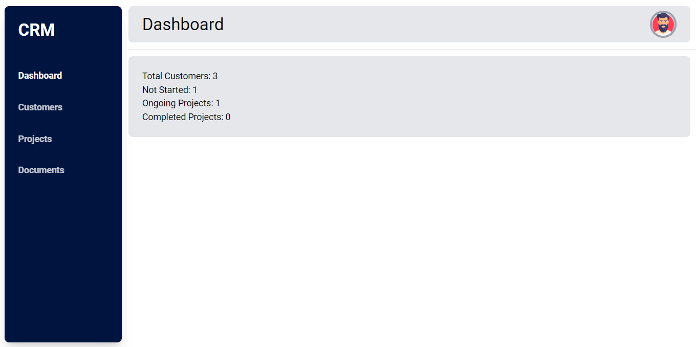

# Customer Relationship Management (CRM) System (Work In Progress)

A simple, efficient Customer Relationship Management (CRM) system built with Django. This system helps manage customer data, track project progress, handle document uploads, and provides a secure link-based document access feature for customers.

## Table of Contents
- [Screenshot](#screenshot)
- [Features](#features)
- [Installation](#installation)
- [Usage](#usage)
- [Project Structure](#project-structure)
- [Models](#models)
- [Views](#views)
- [Security and Access Control](#security-and-access-control)
- [Future Improvements](#future-improvements)
- [Contributing](#contributing)
- [License](#license)

---

## Screenshot



## Not all features are totally complete, many templates lack the design/styling.

## Features
- **Customer Management**: Add, view, edit, and delete customer profiles.
- **Project Tracking**: Track project status with options like *Not Started*, *In Progress*, and *Completed*.
- **Document Management**: Upload and manage documents per customer.
- **Token-based Document Access**: Generate secure, time-limited access links for customers to view and upload documents.
- **User Authentication**: Authentication using Django's built-in user system, with permissions restricted to authenticated users.
- **Email Notifications**: Send email notifications with secure links to customers for document access.

## Installation

1. **Clone the repository:**
   ```bash
   git clone https://github.com/AdnanRahmanpoor/crm_system.git
   cd crm_system
   ```

2. **Create and activate a virtual environment:**
   ```bash
   python3 -m venv venv
   source venv/bin/activate  # On Windows use `venv\Scripts\activate`
   ```

3. **Install dependencies:**
   ```bash
   pip install -r requirements.txt
   ```

4. **Set up environment variables:**
   Create a `.env` file in the root directory with the following:
   ```
   SECRET_KEY=your_secret_key
   DEBUG=True
   
   ```

5. **Run migrations and start the server:**
   ```bash
   python manage.py migrate
   python manage.py runserver
   ```

6. **Create a superuser (Admin):**
   ```bash
   python manage.py createsuperuser
   ```

## Usage

1. **Admin Access**: 
   - Go to `http://127.0.0.1:8000/admin` and log in with the superuser credentials.

2. **Generate Access Links**: 
   - Use the “Generate Access Link” button on a customer's profile to email them a secure link for uploading and downloading documents.

3. **Access Customer Documents**:
   - Customers can use their emailed access link to view and upload documents relevant to them.

## Project Structure

```
CRM-System/
├── customer_management/                    # Main Django app containing models, views, and templates
│   ├── migrations/             # Database migrations
│   ├── templates/              # HTML templates
│   ├── models.py               # Database models (Customer, Project, Document)
│   ├── views.py                # Application views
│   ├── urls.py                 # URL routing for the app
│   └── forms.py                # Forms for handling user input
├── CRM_System/                 # Django project root
│   ├── settings.py             # Django settings
│   ├── urls.py                 # URL routing for the project
│   └── wsgi.py                 # WSGI entry point
├── requirements.txt            # Python dependencies
└── README.md                   # Project documentation
```

## Models

- **Customer**: Contains customer details and an access token for document access.
- **Project**: Tracks projects with a status to indicate progress.
- **Document**: Stores documents related to a customer, allowing for file uploads.

## Views

- **Dashboard**: Main dashboard view
- **customer_list**: A view which lists all customers
- **project_list**: A view which lists all projects 
- **document_list**: A view which lists all documents
- **generate_access_link**: Generates a secure access link for customers and sends it via email.
- **customer_access**: Allows customers to view and upload documents based on a token.
- **upload_document**: Allows customers to upload documents associated with their profile.

## Security and Access Control

- **Access Token**: Customers are granted access to specific pages based on a unique, time-limited access token.
- **Login Required**: Administrative views are restricted to logged-in users.
- **CSRF Protection**: Django’s CSRF protection is applied to forms.

## Future Improvements
- **Two-Factor Authentication (2FA)**: To improve security for admin users.
- **Automated Reminders**: Notify customers when access links are about to expire.
- **File Versioning**: Track different versions of uploaded documents.
- **Advanced Analytics**: Integrate project and customer analytics.
- **Google Calendar**: Integrate Google Calendar for automating appointments.

## Contributing

Contributions are welcome! Please create an issue or open a pull request for any improvements or fixes.

1. Fork the repository.
2. Create a new branch (`git checkout -b feature-branch`).
3. Make your changes and commit them (`git commit -m 'Add some feature'`).
4. Push to the branch (`git push origin feature-branch`).
5. Open a pull request.

## License

This project is licensed under the MIT License. See the [LICENSE](LICENSE) file for details.
